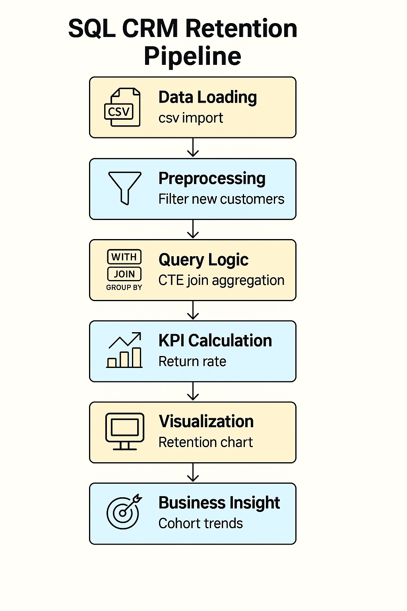
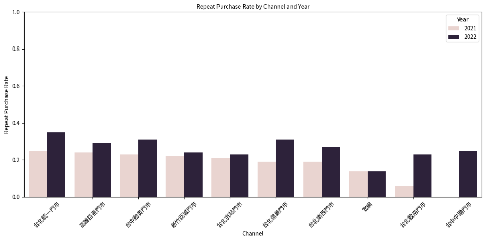
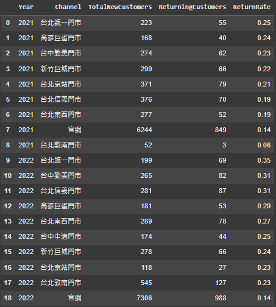
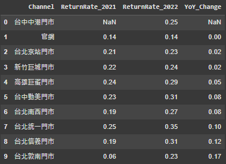
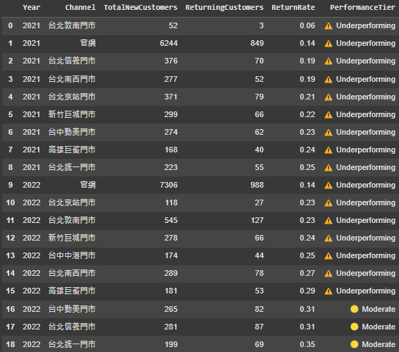

# 🛒 SQL CRM Retention Analysis – Greenvines (AppWorks Simulation)

A structured SQL cohort analysis of new customer return behavior across acquisition channels using simulated e-commerce data. This project mirrors real-world CRM and growth analytics scenarios, applying retention KPIs to drive segmentation and business insights.

---

## 🎯 Project Objective

- Analyze new customer **retention rate by acquisition channel**
- Compare **year-over-year retention performance** (2021 vs 2022)
- Identify **underperforming segments** for CRM targeting
- Translate SQL logic into actionable growth strategy

---

## 🧩 CRM Entity-Relationship Diagram


---

## 🔄 SQL Retention Pipeline Overview



---

## 📦 Dataset Overview

| Table | Description |
|-------|-------------|
| `Customers` | Customer profile: ID, first transaction date, channel |
| `Orders` | Order records with transaction date & customer ID |
| `OrderDetails` | Item-level purchase data |
| `Channels` | Online/offline classification & source info |

---

## 🧮 SQL Logic Structure

> The analysis uses Common Table Expressions (CTEs) to filter cohorts, join customer return activity, and calculate return rates with conditional aggregation.


---

📂 Queries stored in [`/sql`](./sql):

| File | Description |
|------|-------------|
| [`query_1_retention_by_channel.sql`](sql/query_1_retention_by_channel.sql) | Retention rate by channel and year |
| [`query_2_yoy_diff.sql`](sql/query_2_yoy_diff.sql) | YoY retention change |
| [`query_3_flag_underperforming.sql`](sql/query_3_flag_underperforming.sql) | Tier-based channel performance labeling |
---


##📊  Analysis Highlights

### Step 5.1 – Retention Rate by Channel and Year
> Calculates return rates for new customers by acquisition channel and cohort year.
Return rates across channels for both years. Channels like「台北統一門市」showed strong growth.


Data Summary:


### Step 5.2 – Year-over-Year Trends
> Shows which channels improved or declined in retention from 2021 to 2022.
Bar chart showing which acquisition channels improved or declined in 2022.


Data Table:


### Step 5.3 – Performance Tiering
> Labels channels as “Strong”, “Moderate”, or “Underperforming” for action prioritization.
Channel-year pairs are flagged as:
- 🔴 **Underperforming** (< 0.30)
- 🟡 **Moderate** (0.30–0.39)
- 🟢 **Strong** (0.40+)

Table Breakdown:


---
## 💡 Decision Simulation (Use Cases)

### 👩‍💼 PM (Product Manager)
> Design re-engagement flow (email/push/loyalty) for web customers acquired in 2022 with low return rates.

### 📈 Growth Strategist
> Recommend shifting ad spend to retail-based onboarding due to stronger in-store retention trends.

### 💰 Investor / BizOps
> Use return rate as KPI proxy to evaluate CAC effectiveness across channels before reinvestment.

---

## 🛠 Tech Stack

- **SQL (SQLite-style CTE logic)**
- **Google Colab (query execution + visualization)**
- **Notion / GitHub (portfolio presentation)**

---

## 📁 Project Structure
```
SQL_CRM_Retention_Analysis/
├── data/ # Simulated customer & order tables (csv)
├── sql/ # SQL query files
├── notebooks/ # Optional: Jupyter or Colab notebook
├── assets/ # Retention chart images
├── outputs/ # Final KPI tables
└── README.md
```
---

## 📬 Contact

**Hank Lin（林致翰）**  
📧 [chihhanlin99@gmail.com](mailto:chihhanlin99@gmail.com)  
🔗 [GitHub](https://github.com/Hanklin999)  
🔗 [LinkedIn](https://www.linkedin.com/in/hank-lin-a05189181/)  
🌐 [Portfolio (Notion)](https://four-elbow-906.notion.site/Personal-Project-SQL-CRM-Retention-Analysis-208d839e9e7e8010aeebd067b140ca5b?pvs=74) 

